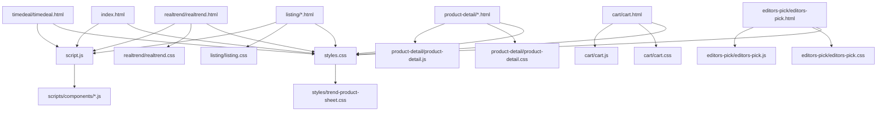

# BridgeOn Architecture

## High-Level Page Map

## CSS Architecture

- `common.css` imports shared base layers from `styles/`.
- `styles.css` is the main page CSS entry for home and shared page UI.
- Component CSS lives under `styles/`.
- Responsive overrides live in matching `styles/responsive-*.css` files.
- `styles/trend-product-sheet.css` owns shared product sheet and cart toast styling.
- `realtrend/realtrend.css` is page-specific and should only be loaded by `realtrend/realtrend.html`.

## JavaScript Architecture

- `script.js` is still the legacy root script.
- Extracted behavior lives in `scripts/components/`.
- `listing/best.js` owns the Best products page ranked 100-item scroll loader.
- `cart/cart.js` owns cart item selection, quantity, delete, and promo form behavior.
- `editors-pick/editors-pick.js` owns Editor's Pick page editor selection, pick filters, wishlist state, and magazine dots.
- `product-detail/product-detail.js` handles product detail specific interactions.

Important extracted components:

- `header-navigation.js`
- `loop-rail.js`
- `product-sheet.js`
- `seller-wishlist.js`
- `magazine-slider.js`
- `deal-sliders.js`
- `hero-slider.js`

## Shared Product Sheet

The product sheet is shared by home, listings, product detail pages, time deal, and Real Trend.

Shared CSS:

- `styles/trend-product-sheet.css`

Shared JS:

- `scripts/components/product-sheet.js`

Do not make non-Real Trend pages load `realtrend/realtrend.css` to get product sheet styling.

## Data And Templates

The project still uses copied HTML for many repeated cards.

Future extraction targets:

- Best Sellers
- Real Trend cards
- Customer Real Picks
- Listing cards
- Category menu data
