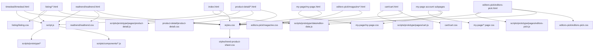

# TrendyPicker Architecture

## High-Level Page Map

```mermaid
flowchart TD
  A["index.html"] --> S["styles.css"]
  A --> JS["script.js"]
  A --> ED["scripts/prototype/data/editor-data.js"]
  L["listing/*.html"] --> S
  L --> LC["listing/listing.css"]
  L --> JS
  PD["product-detail/*.html"] --> S
  PD --> PDC["product-detail/product-detail.css"]
  PD --> PDJ["scripts/prototype/pages/product-detail.js"]
  C["cart/cart.html"] --> S
  C --> CC["cart/cart.css"]
  C --> CJ["scripts/prototype/pages/cart.js"]
  M["my-page/my-page.html"] --> S
  M --> MC["my-page/my-page.css"]
  MAS["my-page account subpages"] --> S
  MAS --> MC
  MAS --> MASC["my-page/* page css"]
  E["editors-pick/editors-pick.html"] --> S
  E --> EC["editors-pick/editors-pick.css"]
  E --> ED
  E --> EJ["scripts/prototype/pages/editors-pick.js"]
  MG["editors-pick/magazine*.html"] --> S
  MG --> MGC["editors-pick/magazine.css"]
  TD["timedeal/timedeal.html"] --> S
  TD --> JS
  RT["realtrend/realtrend.html"] --> S
  RT --> RTC["realtrend/realtrend.css"]
  RT --> JS
  S --> TPS["styles/trend-product-sheet.css"]
  JS --> COMP["scripts/components/*.js"]
  JS --> PROTO["scripts/prototype/*"]
```

## CSS Architecture

- `common.css` imports shared base layers from `styles/`.
- `styles.css` is the main page CSS entry for home and shared page UI.
- Component CSS lives under `styles/`.
- Responsive overrides live in matching `styles/responsive-*.css` files.
- `styles/trend-product-sheet.css` owns shared product sheet and cart toast styling.
- `realtrend/realtrend.css` is page-specific and should only be loaded by `realtrend/realtrend.html`.

## JavaScript Architecture

- `script.js` owns page transitions and shared TrendyPicker URL helpers.
- `scripts/components/bootstrap.js` loads shared presentation components in a stable order.
- Extracted presentation behavior lives in `scripts/components/`.
- Firstmall-replaceable data, storage, pricing, cart, wishlist, listing generation, product detail,
  brand, Editor's Pick, Real Trend, and account controllers live under `scripts/prototype/`.
- Every HTML script tag loading that directory carries `data-prototype`.
- `my-page/profile-birthday.js` owns the birthday calendar.
- `my-page/help-topic-data.js` owns static Help Center topic content.
- `my-page/help-topic.js` owns Help Center topic rendering and interaction.

Important extracted components:

- `header-navigation.js`
- `loop-rail.js`
- `editor-card-slider.js`
- `magazine-slider.js`
- `magazine-links.js`
- `support-footer.js`
- `scroll-reveal.js`
- `deal-sliders.js`
- `hero-slider.js`
- `today-pick-panel.js`
- `section-tabs.js`

## Shared Product Sheet

The product sheet is shared by home, listings, product detail pages, time deal, and Real Trend.

Shared CSS:

- `styles/trend-product-sheet.css`

Shared JS:

- `scripts/prototype/components/product-sheet.js` (replace during Firstmall integration)

Do not make non-Real Trend pages load `realtrend/realtrend.css` to get product sheet styling.

## Data And Templates

The project still uses copied HTML for many repeated cards.

Editor sample data is centralized in `scripts/prototype/data/editor-data.js` so the home T.P Pick
tabs/cards and the Editor's Pick page stay aligned during prototype use.

Future extraction targets:

- Best Sellers
- Real Trend cards
- Customer Real Picks
- Listing cards
- Category menu data

## Firstmall Integration Boundary

The static storefront is the visual source for a future Firstmall work skin, not a drop-in skin.
Keep Firstmall commerce behavior as the source of truth for goods, options, stock, cart, wishlist,
member, order, coupon, point, review, inquiry, and payment data.

The first isolated work-skin package lives in `firstmall-workskin/`. It currently contains the
active My Page dashboard template, the native `mypage/myinfo.html` profile form integration,
the native `mypage/order_catalog.html` order-history integration,
their scoped styles under `css/redesign/`, shared account scripts mirrored under
`app/javascript/js/`, and upload/testing instructions. The profile page
keeps `{# form_member}` and Firstmall's original member handlers; the static prototype's payment
and address samples are not part of the work skin. Existing Firstmall header, footer, index, and
other account subpages remain untouched.
The shared account shell owns a 909px desktop content column and the My Page cross-page fade.
The production order work-skin has no query-gated visual fixture. The order catalog and dashboard
render only Firstmall's live collections or their native empty states.

The Firstmall Help Center route is `/service/cs`, owned by `firstmall-workskin/service/cs.html`.
Its hero and directory mirror `my-page/help-center.html`, its presentation lives in
`css/redesign/trendypicker-help.css`, and its links resolve to Firstmall's native notice, FAQ,
inquiry, guide, policy, and company routes. The directory needs no page-specific JavaScript.
The linked service templates, the customer-service modes of `board/index.html`, and
`mypage/myqna_catalog.html` share `css/redesign/trendypicker-help-topic.css`. This layer changes
presentation only and preserves native board collections, inquiry actions, and policy content.
Server-runtime Firstmall HTML is validated separately by
`tools/check-firstmall-workskin.mjs`.

The detailed readiness and page mapping are documented in
`docs/firstmall-integration-readiness.md`.
